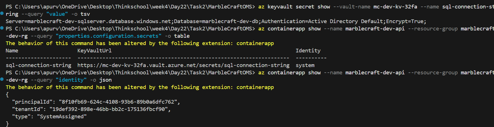

# Day 25 — Identity End-to-End

## What Was Built

| Path | What it does |
|---|---|
| MI → SQL | Container App's system-assigned managed identity authenticates to Azure SQL via `Authentication=Active Directory Default` — no username or password |
| MI → Service Bus | `DefaultAzureCredential` resolves to managed identity in Azure; granted `Data Sender` + `Data Receiver` RBAC roles on the namespace |
| Entra ID app auth | `AddMicrosoftIdentityWebApi` validates bearer tokens; `[Authorize]` on `GET /api/me` proves enforcement — returns 401 without a token |
| Key Vault references | `KeyVault:Uri` in appsettings loads all remaining config at startup via managed identity; no secrets in environment variables |

---

## MI Wiring — Program.cs

```csharp
// Key Vault — reads secrets at startup via Managed Identity; skipped locally (Uri is empty)
var keyVaultUri = builder.Configuration["KeyVault:Uri"];
if (!string.IsNullOrEmpty(keyVaultUri))
{
    builder.Configuration.AddAzureKeyVault(
        new Uri(keyVaultUri),
        new DefaultAzureCredential());
}

// EF Core — Managed Identity handles SQL auth in Azure; LocalDB Trusted_Connection handles dev
builder.Services.AddDbContext<AppDbContext>(options =>
    options.UseSqlServer(builder.Configuration.GetConnectionString("DefaultConnection")));

// Service Bus — DefaultAzureCredential resolves to Managed Identity in Azure; no key ever needed
builder.Services.AddAzureClients(clients =>
{
    clients.AddServiceBusClient(builder.Configuration["ServiceBus:Namespace"]);
    clients.UseCredential(new DefaultAzureCredential());
});

// Entra ID JWT — validates bearer tokens issued by Azure AD for this app registration
builder.Services.AddAuthentication()
    .AddMicrosoftIdentityWebApi(builder.Configuration.GetSection("AzureAd"));
```

---

## Key Vault Reference — appsettings.json

```json
"KeyVault": {
  "Uri": "https://mc-dev-kv-32fa.vault.azure.net/"
}
```

At startup, `AddAzureKeyVault` loads all secrets from this vault using the managed identity. The SQL connection string lives in Key Vault — not in appsettings, not in environment variables.

---

## Zero Secrets Proof

**1. Connection string in Key Vault — no password**
```
az keyvault secret show --vault-name mc-dev-kv-32fa --name sql-connection-string --query "value" -o tsv

Server=marblecraft-dev-sqlserver.database.windows.net;Database=marblecraft-dev-db;Authentication=Active Directory Default;Encrypt=True;
```
No `Password=`, no `User Id=` — zero credentials.

**2. Container App pulls from Key Vault, not plain text**
```
az containerapp show ... --query "properties.configuration.secrets" -o table

Name                   KeyVaultUrl                                                           Identity
---------------------  --------------------------------------------------------------------  ----------
sql-connection-string  https://mc-dev-kv-32fa.vault.azure.net/secrets/sql-connection-string  system
```
Secret is a Key Vault reference. The `system` identity pulls it at runtime.

**3. System-assigned Managed Identity — no client secrets**
```
az containerapp show ... --query "identity" -o json

{
  "principalId": "8f10fb69-624c-4108-93b6-89b0a6dfc762",
  "type": "SystemAssigned"
}
```
Authenticates to Key Vault, SQL, and Service Bus — no passwords anywhere.



---

## What Was Learned

**Over-building reflection**

The problem statement said *"prove"* — that only needed:
- One endpoint that queries SQL → proves Managed Identity to SQL works
- One endpoint that publishes to Service Bus → proves Managed Identity to Service Bus works
- `[Authorize]` on those endpoints → proves Entra ID auth works
- No secrets anywhere in config → prove by showing appsettings.json

That is 2–3 endpoints maximum. Instead, a full CRUD application was built: 4 entities, 4 controllers, seed data, domain models, and a full EF Core schema.

**Why it happened:** Empty stub files (controllers, models, repositories) were treated as a to-do list and filled completely, instead of asking *"what does Day 25 actually need?"*

**Rule going forward:** Read the problem statement requirements first. Identify the minimum needed to satisfy each one. Build only that.