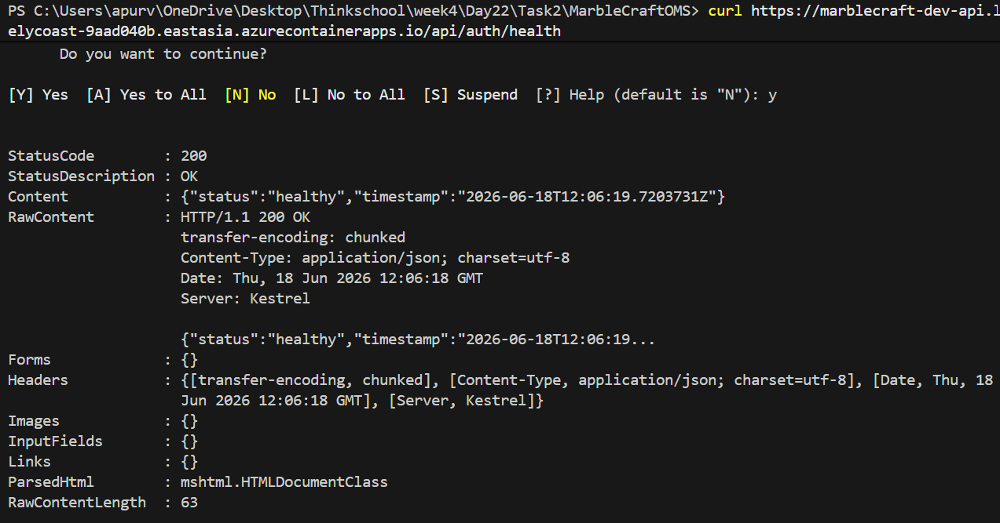
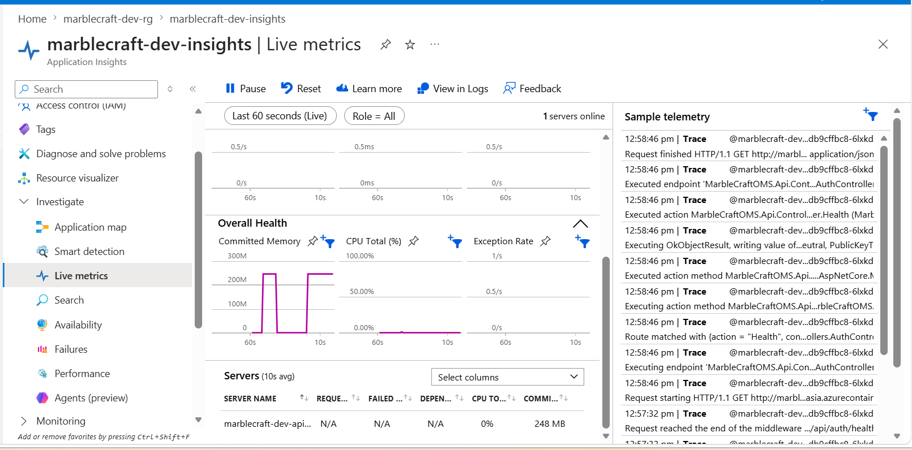
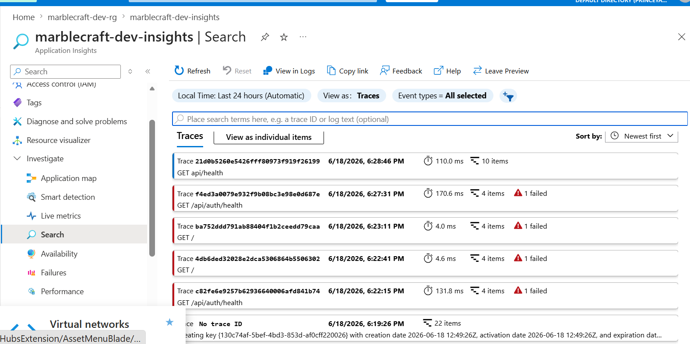
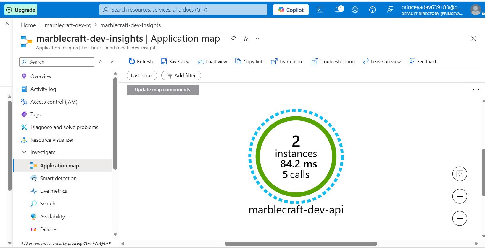
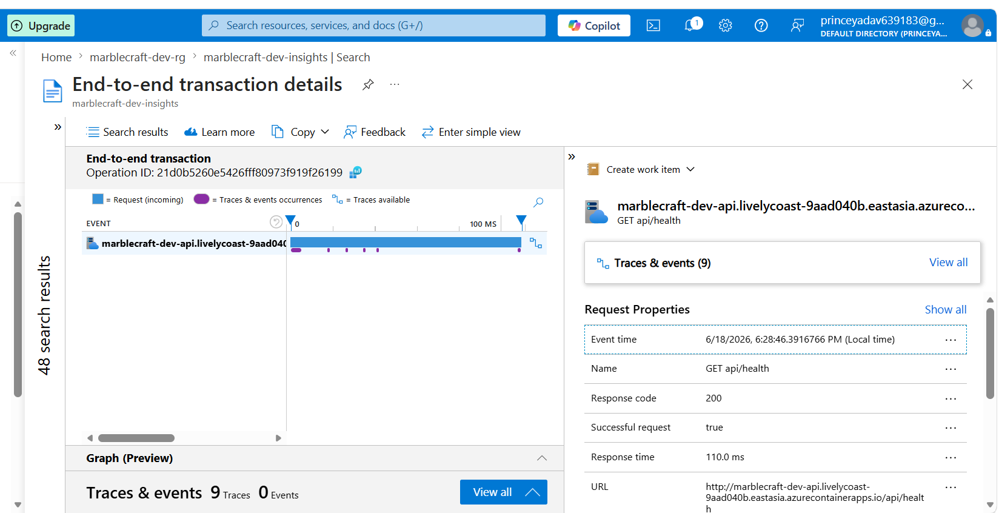
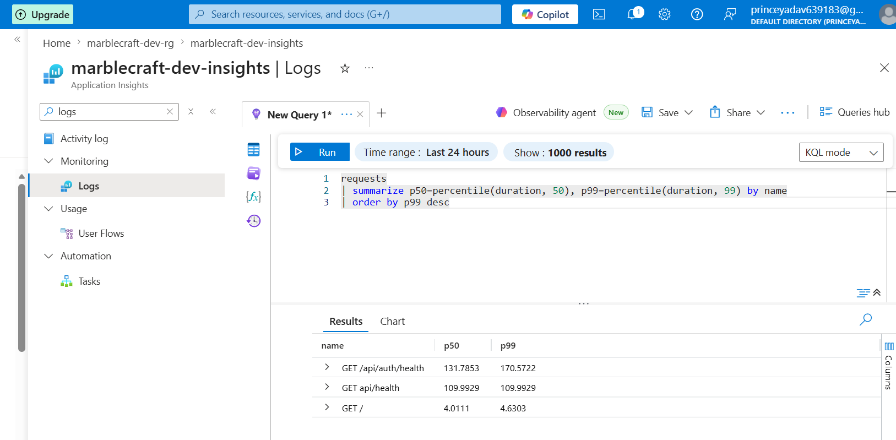
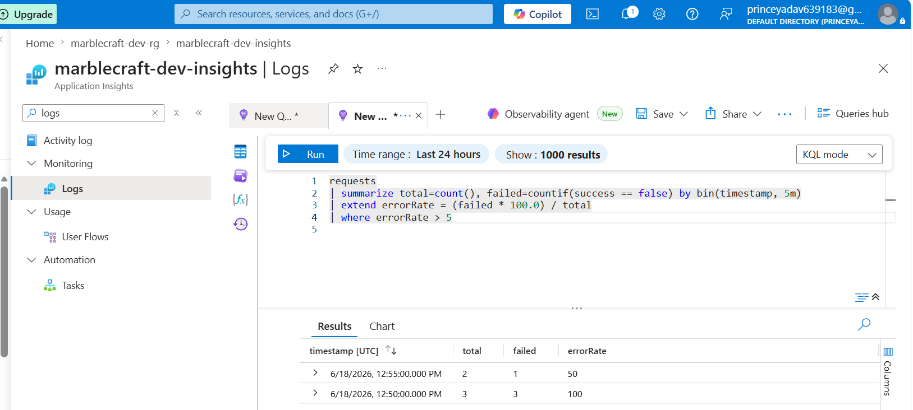

# Day 26 — OpenTelemetry + Application Insights

## What was built

Wired distributed tracing and structured logging into MarbleCraftOMS using OpenTelemetry and Azure Monitor. Every API request now produces a connected trace spanning HTTP ingress → SQL dependency, visible as a single flow in App Insights.

---

## Step 1 — Packages added

| Package | Purpose |
|---|---|
| `Azure.Monitor.OpenTelemetry.AspNetCore` | Azure Monitor distro — wires OTel → App Insights, includes ASP.NET Core + Azure SDK instrumentation |
| `OpenTelemetry.Instrumentation.EntityFrameworkCore` | Captures EF Core SQL calls as child spans |

---

## Step 2 — OpenTelemetry wiring (Program.cs)

```csharp
builder.Services.AddOpenTelemetry()
    .UseAzureMonitor(options =>
    {
        options.ConnectionString = builder.Configuration["appinsights-connection-string"];
    })
    .WithTracing(tracing => tracing
        .AddEntityFrameworkCoreInstrumentation());

builder.Logging.AddOpenTelemetry(o =>
{
    o.IncludeFormattedMessage = true;
    o.IncludeScopes = true;
});
```

Connection string comes from Key Vault (`appinsights-connection-string`) — never hardcoded.

---

## Step 3 — Structured logging in SuppliersController

Every mutating endpoint logs a structured event:

```
Endpoint=GetAll ResultCount=12 DurationMs=43
Endpoint=Add SupplierId=7 DurationMs=81
Endpoint=Update SupplierId=3 DurationMs=55
Endpoint=Delete SupplierId=3 DurationMs=38
```

All log entries carry the OTel trace/span ID automatically — enabling correlation from any log line back to the full distributed trace.

---

## Step 4 — App Insights resource

```bash
# Create component
az monitor app-insights component create \
  --app marblecraft-dev-insights \
  --location eastasia \
  --resource-group marblecraft-dev-rg \
  --application-type web

# Get connection string
az monitor app-insights component show \
  --app marblecraft-dev-insights \
  --resource-group marblecraft-dev-rg \
  --query connectionString -o tsv

# Store in Key Vault
az keyvault secret set \
  --vault-name mc-dev-kv-32fa \
  --name appinsights-connection-string \
  --value "<connection-string>"
```

---

## Step 5 — Live API + App Insights verification

### Health endpoint responding (no token required)



### Live Metrics stream



### Transaction Search



### Application Map



---

## Step 6 — Distributed trace



---

## Step 7 — KQL queries

See [day26-kql.md](day26-kql.md) for all three queries.

### p50 / p99 by endpoint

```kql
requests
| summarize p50=percentile(duration, 50),
            p99=percentile(duration, 99)
  by name
| order by p99 desc
```



### Dependency breakdown

```kql
dependencies
| summarize count(), avg(duration)
  by type, target
| order by avg_duration desc
```



### Error rate alert

```kql
requests
| summarize total=count(),
            failed=countif(success == false)
  by bin(timestamp, 5m)
| extend errorRate = (failed * 100.0) / total
| where errorRate > 5
```

---

## What distributed tracing gives you

A single trace ID threads the HTTP request, the EF Core SQL call, and any Service Bus publish into one timeline — so when latency spikes or an error fires, you see exactly which hop caused it without grepping across separate log streams.
