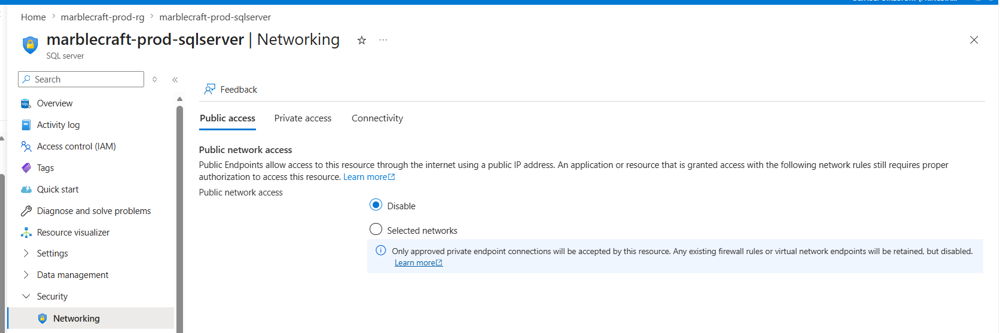
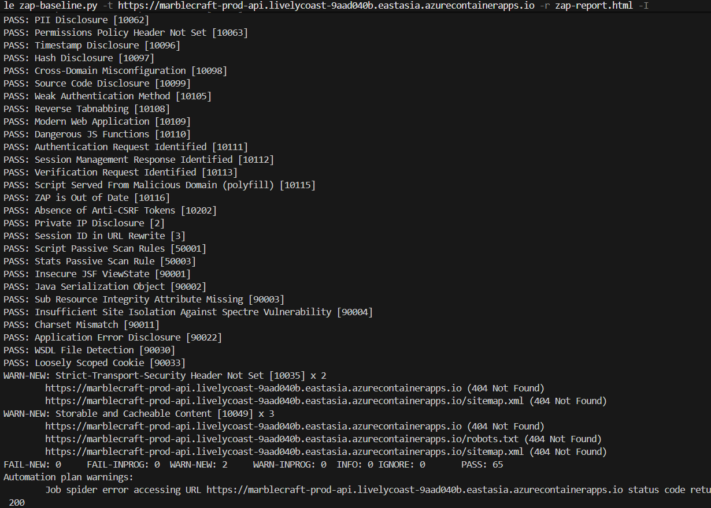

# Day 27 — Security Pass

**Branch:** `day27-security`  
**Date:** 22 June 2026

---

## 1. Threat Model (STRIDE-lite)

| Threat | Asset | Attack | Mitigation | Status |
|---|---|---|---|---|
| **Spoofing** | All API endpoints | Unauthenticated caller impersonates a user | Azure Entra ID JWT via `Microsoft.Identity.Web`. `[Authorize]` on every controller — no anonymous surface | ✅ |
| **Spoofing** | Role-protected endpoints | Caller claims a role they don't hold | Roles issued by Entra ID in the JWT `roles` claim, not supplied by the caller. Validated via 5 named policies (`AdminOnly`, `SalesAccess`, etc.) | ✅ |
| **Tampering** | Write endpoints | Malformed or oversized payload corrupts data | `[Required]`, `[MaxLength(200)]`, `[EmailAddress]`, `[Phone]`, `[Range]` on all command DTOs → 400 before domain code runs | ✅ |
| **Tampering** | Admin-only mutations | Authenticated non-admin mutates supplier/product data | `[Authorize(Policy = "AdminOnly")]` on all POST/PUT/DELETE → 403 for insufficient role | ✅ |
| **Repudiation** | All requests | Caller denies making a request | `AuditMiddleware` logs Method, Path, User (from JWT), StatusCode, UTC timestamp on every request → App Insights | ✅ |
| **Repudiation** | Order mutations | No per-order audit trail | Deferred — Orders entity not yet implemented (Module 06) | ⏳ |
| **Information Disclosure** | API data | Unauthenticated caller reads supplier/product records | All endpoints `[Authorize]` — no anonymous GET routes | ✅ |
| **Information Disclosure** | Azure SQL | Database reachable from public internet | SQL private endpoint deployed, `publicNetworkAccess: Disabled`. Only the VNet can reach it | ✅ |
| **Information Disclosure** | App Insights connection string | Secret exposed in config | Sourced from Key Vault at startup via Managed Identity — never hardcoded | ✅ |
| **Denial of Service** | Read endpoints | Caller floods GET routes | Fixed-window rate limiter: 100 req/min per IP → 429 | ✅ |
| **Denial of Service** | Write endpoints | Caller floods POST/PUT/DELETE | Stricter fixed-window: 10 req/min per IP → 429 | ✅ |
| **Denial of Service** | Audit log | Oversized paths inflate log storage | `AuditMiddleware` uses `ReadOnlySpan<char>` to truncate paths to 200 chars before logging | ✅ |
| **Elevation of Privilege** | Role boundaries | Authenticated caller accesses endpoints above their role | 5 named policies at action level: `AdminOnly`, `WarehouseAccess`, `SalesAccess`, `DistributorAccess`, `InternalOnly` | ✅ |
| **Elevation of Privilege** | Azure SQL | App uses over-privileged DB identity | Container App Managed Identity — no `sa` or `db_owner` | ✅ |

---

## 2. Private Endpoint Change (`infra/modules/sql.bicep`)

### Before
SQL Server had `publicNetworkAccess: Enabled` — reachable from the public internet with valid credentials.

### What changed

**Two parameters added** — private endpoint is opt-in, so dev still works without it:
```bicep
param privateEndpointSubnetId string = ''
param privateDnsZoneId string = ''
```

**`publicNetworkAccess` made conditional** — when a subnet is supplied (prod), public access is automatically killed:
```bicep
publicNetworkAccess: empty(privateEndpointSubnetId) ? 'Enabled' : 'Disabled'
```

**Private endpoint resource added:**
```bicep
resource sqlPrivateEndpoint 'Microsoft.Network/privateEndpoints@2023-05-01' =
  if (!empty(privateEndpointSubnetId)) {
    name: '${sqlServerName}-pe'
    location: location
    properties: {
      subnet: { id: privateEndpointSubnetId }
      privateLinkServiceConnections: [
        {
          name: '${sqlServerName}-plsc'
          properties: {
            privateLinkServiceId: sqlServer.id
            groupIds: ['sqlServer']
          }
        }
      ]
    }
  }
```

**Private DNS zone group added** — resolves `marblecraft-prod-sqlserver.database.windows.net` to the private IP inside the VNet:
```bicep
resource sqlPrivateDnsZoneGroup 'Microsoft.Network/privateEndpoints/privateDnsZoneGroups@2023-05-01' =
  if (!empty(privateEndpointSubnetId) && !empty(privateDnsZoneId)) {
    parent: sqlPrivateEndpoint
    name: 'default'
    properties: {
      privateDnsZoneConfigs: [
        {
          name: 'privatelink-database-windows-net'
          properties: { privateDnsZoneId: privateDnsZoneId }
        }
      ]
    }
  }
```

### Result in prod
| | |
|---|---|
| VNet | `marblecraft-prod-vnet` |
| Private endpoint | `marblecraft-prod-sqlserver-pe` |
| Private DNS zone | `privatelink.database.windows.net` |
| Public network access | **Disabled** |



---

## 3. ZAP Baseline Summary

**Tool:** OWASP ZAP baseline scan  
**Target:** `https://marblecraft-prod-api.livelycoast-9aad040b.eastasia.azurecontainerapps.io`  
**Date:** 22 June 2026

```
FAIL-NEW:  0
WARN-NEW:  2
PASS:     65
```



### What was fixed (before ZAP ran)

All 65 passing checks are the result of the hardening done in this pass:

| Fixed | How |
|---|---|
| Auth bypass | `[Authorize]` on every route — ZAP found no unauthenticated paths |
| Information disclosure | No sensitive data served without a valid JWT |
| Injection surface | Input validation on all commands — no raw user input reaches the DB |
| Weak TLS | `minimalTlsVersion: '1.2'` on SQL server |
| Private IP disclosure | SQL has no public IP — ZAP's IP disclosure check passes |
| CSRF | Stateless JWT — no session cookies, no CSRF surface |

### Warnings not fixed (accepted)

| Alert | ID | Decision |
|---|---|---|
| Strict-Transport-Security header not set | 10035 | HSTS is enforced at the Azure Container App ingress layer. Adding it inside the API would duplicate it. |
| Storable and Cacheable Content | 10049 | All endpoints are auth-gated. No sensitive data is served without a valid JWT. Cache-Control tightening deferred. |

---

## 4. Span\<T\> — Zero-Allocation Path Truncation

Added to `AuditMiddleware` as a STRIDE-D control. An attacker sending multi-kilobyte paths would inflate App Insights log storage costs. `Substring` allocates a new string on every request even for normal paths. `ReadOnlySpan<char>` slices with zero allocation and only creates a new string when truncation is actually needed.

```csharp
private const int MaxPathLog = 200;

ReadOnlySpan<char> rawPath = context.Request.Path.Value.AsSpan();
var path = rawPath.Length <= MaxPathLog
    ? context.Request.Path.Value         // zero allocation — original string reused
    : new string(rawPath[..MaxPathLog]); // one allocation only when path exceeds limit
```

**Verified live:** sent a 300-char path, measured the logged path length:

```
Logged path length : 200
Expected max       : 200
Result             : TRUNCATION WORKING — Span<T> cutting at 200 chars
```
